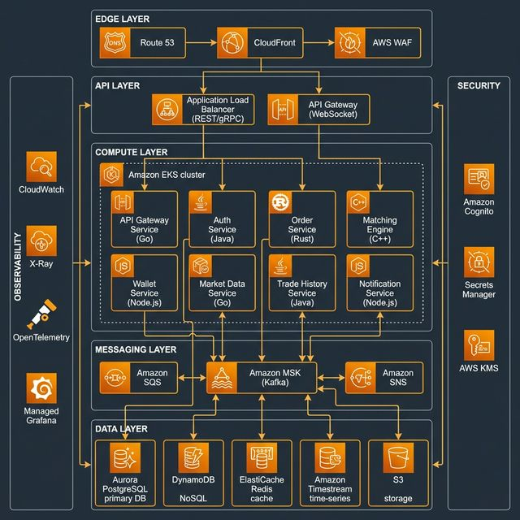
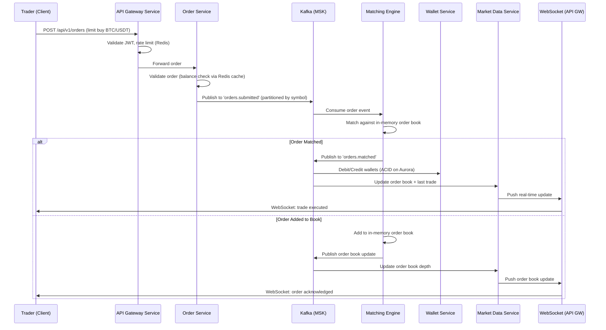
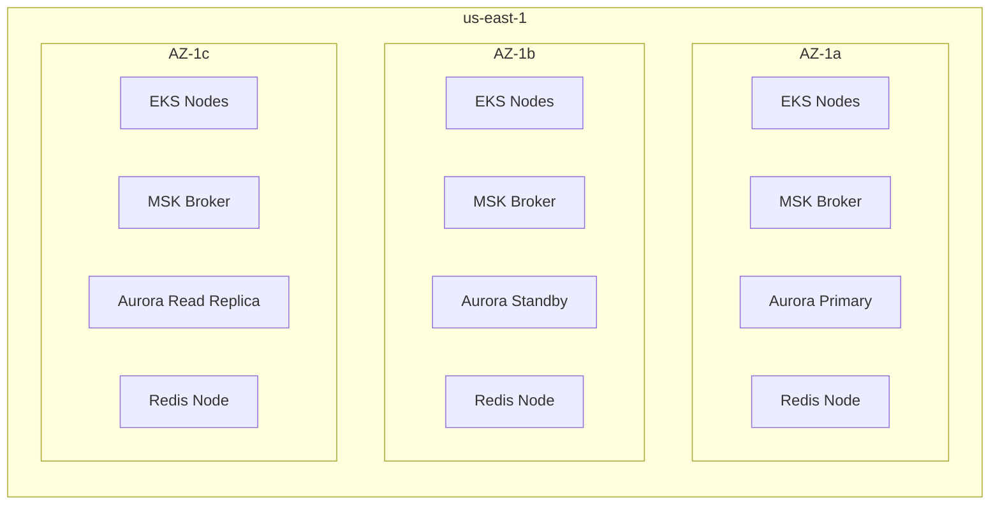

Provide your solution here:
# Castle In The Cloud — Highly Available Trading System on AWS

## Challenge Overview

This architecture document outlines the design for a highly available, scalable, and cost-effective trading platform on AWS. The system targets 500 requests per second with a p99 response time under 100ms, while maintaining financial-grade reliability and auditability.

### Constraints Recap

| Parameter | Value |
|-----------|-------|
| **Cloud Provider** | AWS |
| **Throughput** | 500 req/s |
| **Response Time** | p99 < 100ms |

---

### 1 — Select Features to Demonstrate

> [!IMPORTANT]
> You can't cover all of Binance. Pick features that showcase **HA, scalability, and real-time processing**.

**Recommended feature set** (demonstrates maximum architecture breadth):

| # | Feature | Why It Matters |
|---|---------|---------------|
| 1 | **User Authentication & KYC** | Security, identity management, compliance |
| 2 | **Spot Trading (Order Matching)** | Core business logic, ultra-low latency, consistency |
| 3 | **Order Book & Market Data** | Real-time streaming, WebSocket, pub/sub |
| 4 | **Wallet & Balance Management** | ACID transactions, eventual consistency patterns |
| 5 | **Trade History & Reporting** | Analytics, time-series data, CQRS pattern |
| 6 | **Notifications (Price Alerts)** | Event-driven architecture, push notifications |

---

### 2 — Design the Architecture

Below is the **complete AWS architecture** for a production-grade trading system.

---

## Architecture Overview Diagram



### Detailed Service Topology (Mermaid)


---

## Service-by-Service Breakdown

### 1. Edge & Networking Layer

| Service | Role | Why This Choice | Alternatives Considered |
|---------|------|-----------------|------------------------|
| **Route 53** | DNS routing with health checks, latency-based routing | Native AWS integration, 100% SLA, supports failover routing policies | Cloudflare DNS — good but adds external dependency |
| **CloudFront** | CDN for static assets (trading UI SPA), also terminates TLS at edge | Reduces latency for global users, integrates with WAF natively | Cloudflare CDN — comparable but Route 53 → CloudFront is simpler |
| **AWS WAF** | Rate limiting, SQL injection/XSS protection, geo-blocking | Critical for financial systems; integrates with ALB and CloudFront | ModSecurity on Nginx — more control but heavy ops burden |

### 2. API Layer

| Service | Role | Why This Choice | Alternatives Considered |
|---------|------|-----------------|------------------------|
| **Application Load Balancer** | HTTP/HTTPS routing to EKS services, path-based routing | Native EKS integration via AWS Load Balancer Controller, supports gRPC | NLB — lower latency but no L7 routing; only appropriate for matching engine if extracted |
| **API Gateway (WebSocket)** | Managed WebSocket connections for real-time market data streams | Handles connection lifecycle, scales to millions of connections, IAM auth | Self-managed WebSocket on EKS — more control but operationally expensive for connection management at scale |

### 3. Compute Layer — Amazon EKS

| Service | Role | Why This Choice | Alternatives Considered |
|---------|------|-----------------|------------------------|
| **Amazon EKS (Multi-AZ)** | Container orchestration for all microservices | Industry standard, supports HPA/VPA/KEDA for auto-scaling, multi-AZ by default | **ECS Fargate** — simpler but less control over scheduling; **EC2 directly** — too much ops overhead; **Lambda** — cold start violates p99 < 100ms |

#### Microservice Design

| Service | Language | Scaling Strategy | Notes |
|---------|----------|-----------------|-------|
| **API Gateway Service** | Go / Java | HPA on CPU + request rate | Stateless, horizontal scaling |
| **Auth Service** | Java / Node.js | HPA on CPU | Token validation cached in Redis |
| **Order Service** | Go | HPA on queue depth | Validates & publishes to Kafka |
| **Matching Engine** | Go / Rust / C++ | Vertical + partition by symbol | **Most latency-critical** — in-memory order book |
| **Wallet Service** | Java | HPA on CPU | ACID transactions on Aurora |
| **Market Data Service** | Go / Node.js | HPA on WebSocket connections | Consumes from Kafka, pushes via WebSocket |
| **Trade History Service** | Java | HPA on Kafka consumer lag | CQRS read model |
| **Notification Service** | Node.js | HPA on SQS queue depth | Fan-out via SNS → SQS |

> [!TIP]
> The **Matching Engine** is the heart of the system. At 500 req/s, a single Go/Rust instance can handle this easily. Partition by trading pair (symbol) for horizontal scaling when needed.

### 4. Messaging Layer

| Service | Role | Why This Choice | Alternatives Considered |
|---------|------|-----------------|------------------------|
| **Amazon MSK (Kafka)** | Event backbone — order events, trade events, market data updates | Guaranteed ordering per partition (critical for order matching), high throughput, replay capability | **Amazon Kinesis** — simpler but less ecosystem tooling and no consumer groups; **SQS** — no ordering guarantees across consumers |
| **Amazon SQS** | Dead-letter queues, notification delivery | Managed, no ops overhead, integrates with Lambda | RabbitMQ on EKS — more features but operational cost |
| **Amazon SNS** | Fan-out for notifications (email, SMS, push) | Multi-protocol delivery, integrates with SQS for buffering | Self-managed push — unnecessary complexity |

#### Kafka Topic Design

```
orders.submitted       → Order Service → Matching Engine
orders.matched         → Matching Engine → Trade History, Wallet, Market Data
orders.cancelled       → Matching Engine → Wallet, Notification
market.trades          → Matching Engine → Market Data Service
market.orderbook       → Matching Engine → Market Data Service (snapshots)
wallet.transactions    → Wallet Service → Notification Service
```

### 5. Data Layer

| Service | Role | Why This Choice | Alternatives Considered |
|---------|------|-----------------|------------------------|
| **Aurora PostgreSQL (Multi-AZ)** | User accounts, wallets, order records — ACID-critical data | Multi-AZ failover (<30s), read replicas for read scaling, up to 128TB | **RDS PostgreSQL** — no auto-scaling storage; **CockroachDB** — better horizontal scaling but higher cost and operational complexity |
| **Amazon DynamoDB** | Trade history, session data, API keys — high-read workloads | Single-digit ms latency, auto-scaling, global tables for DR | **MongoDB Atlas** — flexible schema but more ops on AWS; **Aurora** — could work but DynamoDB scales better for key-value access patterns |
| **ElastiCache Redis (Cluster Mode)** | Order book cache, rate limiting, session cache, real-time leaderboards | Sub-millisecond latency, cluster mode for sharding, pub/sub for real-time updates | **Memcached** — no persistence, no pub/sub; **DynamoDB DAX** — only accelerates DynamoDB reads |
| **Amazon Timestream** | Candlestick/OHLCV data, performance metrics, time-series analytics | Purpose-built for time-series, automatic tiering (memory → magnetic), SQL-compatible | **InfluxDB on EC2** — powerful but operational overhead; **TimescaleDB on Aurora** — viable but Timestream is fully managed |
| **S3** | Static assets, trade report exports, database backups, compliance archives | Virtually unlimited storage, lifecycle policies, cross-region replication | No real alternative at this scale/price |

### 6. Security & Identity

| Service | Role | Why This Choice | Alternatives Considered |
|---------|------|-----------------|------------------------|
| **Amazon Cognito** | User registration, login, MFA, OAuth2/OIDC | Managed user pools, adaptive auth, integrates with ALB | **Auth0** — more features but external dependency and cost; **Keycloak on EKS** — full control but heavy ops |
| **AWS Secrets Manager** | API keys, DB credentials, third-party secrets | Auto-rotation, audit trail via CloudTrail, native SDK support | **HashiCorp Vault** — more powerful but requires cluster management |
| **AWS KMS** | Encryption keys for data at rest and in transit | FIPS 140-2 compliant, integrates with all AWS services | **CloudHSM** — for regulatory requirements needing dedicated HSM; overkill for most cases |

### 7. Observability Stack

| Service | Role | Why This Choice | Alternatives Considered |
|---------|------|-----------------|------------------------|
| **CloudWatch** | Logs, metrics, alarms | Native integration, cost-effective for AWS workloads | **Datadog** — better UI but expensive; **ELK on EKS** — powerful but heavy ops |
| **AWS X-Ray** | Distributed tracing across microservices | Native integration with EKS, API Gateway, Lambda | **Jaeger** — open source but self-managed; **Datadog APM** — excellent but costly |
| **OpenTelemetry** | Vendor-neutral instrumentation | Future-proof, can export to any backend | Proprietary agents — vendor lock-in |
| **Amazon Managed Grafana** | Dashboards and visualization | Managed, integrates with CloudWatch/Timestream/X-Ray | **Self-hosted Grafana** — same features but ops overhead |

---

## Architecture Deep Dive: Order Flow

This is the most critical path and demonstrates how HA + low latency work together.

<!-- [MermaidChart: ba32b1c7-2e40-40e0-baf1-f4c69cb60054] -->


### Latency Budget (p99 < 100ms target)

| Segment | Expected p99 | Notes |
|---------|-------------|-------|
| CloudFront → ALB | ~5ms | Edge termination, keep-alive |
| ALB → API Gateway Service | ~2ms | Same VPC, same AZ preferred |
| JWT Validation (Redis) | ~1ms | Cached token validation |
| Order Validation | ~3ms | Balance check from Redis cache |
| Kafka Produce | ~5ms | Acks=1, same AZ broker |
| **Total API Response** | **~16ms** | Order acknowledged |
| Kafka → Matching Engine | ~5ms | Consumer pull |
| Matching Engine Processing | ~1ms | In-memory, lock-free |
| **Total E2E (to match)** | **~22ms** | Well within 100ms |

> [!NOTE]
> The p99 < 100ms is measured at the **API response** level (order acknowledged), not end-to-end match. The asynchronous matching adds ~5-10ms more but is not on the critical API path.

---

## High Availability Design

### Multi-AZ Architecture



| Component | HA Strategy | RTO | RPO |
|-----------|------------|-----|-----|
| **EKS** | Multi-AZ node groups, PDB, pod anti-affinity | ~0 (pods reschedule) | N/A (stateless) |
| **Aurora** | Multi-AZ standby, auto-failover | < 30s | 0 (synchronous replication) |
| **ElastiCache Redis** | Cluster mode, multi-AZ replicas | < 20s | ~seconds |
| **MSK (Kafka)** | 3 brokers across 3 AZs, replication factor 3 | ~0 (leader election) | 0 (ISR replication) |
| **Matching Engine** | Active-passive per symbol partition, state recovery from Kafka | < 5s (new consumer starts) | 0 (replay from Kafka) |

### Failure Scenarios Handled

| Failure | Impact | Mitigation |
|---------|--------|------------|
| Single AZ outage | 1/3 capacity lost | EKS reschedules pods, Aurora failover, Kafka leader election |
| Matching engine crash | Orders stop matching for affected symbols | Kafka replay — new instance rebuilds order book from event log |
| Database failover | Write pause for ~30s | Aurora Multi-AZ auto-failover; Redis serves cached reads |
| Kafka broker failure | Temporary producer latency spike | Replication factor 3, min.insync.replicas=2 |

---

## Scaling Plan — Beyond 500 req/s

### Phase 1: 500 → 5,000 req/s

| Component | Scaling Action |
|-----------|---------------|
| **EKS** | HPA scales pods horizontally; add Karpenter for node auto-provisioning |
| **Aurora** | Add read replicas (up to 15); connection pooling with PgBouncer |
| **Redis** | Scale cluster shards; use Redis Cluster mode with more nodes |
| **Kafka** | Add partitions per topic (1 partition per symbol for matching) |
| **API Gateway** | Add more pods; consider gRPC between internal services to reduce serialization overhead |

### Phase 2: 5,000 → 50,000 req/s

| Component | Scaling Action |
|-----------|---------------|
| **Matching Engine** | Dedicated EC2 instances (c7g.metal) with kernel bypass networking (DPDK) per top symbol |
| **Database** | Shard Aurora by symbol group; introduce DynamoDB for order storage (hot path only) |
| **Kafka** | Dedicated MSK cluster per domain (orders, market data); tiered storage for cold data |
| **Networking** | Move to NLB for matching engine path; enable PrivateLink for inter-service |
| **Caching** | Redis → Redis on Graviton with enhanced I/O; add local L1 cache in services |

### Phase 3: 50,000+ req/s (Global Scale)

| Component | Scaling Action |
|-----------|---------------|
| **Multi-Region** | Active-active in us-east-1 + ap-southeast-1; DynamoDB Global Tables |
| **Matching Engine** | FPGA-accelerated matching (AWS F1 instances) or custom hardware |
| **Event Streaming** | MSK multi-region replication; Global Kafka clusters |
| **Data** | Federated Aurora Global Database (write forwarding); Timestream multi-region |
| **Edge** | CloudFront + Lambda@Edge for API routing; Regional API Gateway deployments |

---

## Cost Estimation (Phase 1 — 500 req/s)

| Service | Configuration | Est. Monthly Cost |
|---------|--------------|-------------------|
| **EKS** | 1 cluster + 6x m6g.xlarge (multi-AZ) | ~$1,200 |
| **Aurora PostgreSQL** | db.r6g.xlarge Multi-AZ + 1 read replica | ~$850 |
| **ElastiCache Redis** | cache.r6g.large cluster (3 nodes) | ~$450 |
| **MSK (Kafka)** | kafka.m5.large x3, 1TB storage | ~$650 |
| **DynamoDB** | On-demand, ~5M reads + 1M writes/month | ~$100 |
| **CloudFront** | 1TB transfer/month | ~$85 |
| **API Gateway (WebSocket)** | 10M messages/month | ~$35 |
| **Route 53 + WAF** | 1 hosted zone + managed rules | ~$50 |
| **Timestream** | 10GB writes, 50GB queries/month | ~$75 |
| **Secrets Manager + KMS** | 10 secrets + 100K API calls | ~$15 |
| **CloudWatch + X-Ray** | Standard tier | ~$100 |
| **Managed Grafana** | 1 workspace | ~$9 |
| **S3** | 100GB + lifecycle policies | ~$5 |
| **Total** | | **~$3,625/month** |

> [!TIP]
> Use **Savings Plans** (1-year compute) and **Reserved Instances** for Aurora/ElastiCache to reduce cost by 30-40%. Realistic production cost: **~$2,200-2,500/month** with commitments.
